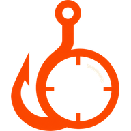

# Hookscope



Browser-native Uniswap v4 hook behavior analysis and execution transparency.

Hookscope provides DeFi execution transparency by tracing pool callbacks and recording tested execution outcomes.

Hookscope discovers pools for a token, resolves their hooks and implementations, maps reachable behavior, and records what happened during bounded execution. Reports keep deterministic facts, static reachability, concrete observations, and generated-input outcomes separate. They describe what was tested and found; they do not claim that a contract is safe.

## What it does

- Discovers and verifies Uniswap v4 pools at a pinned block.
- Resolves hook bytecode, proxies, verified source, ABIs, selectors, and permissions.
- Runs static analysis in browser workers with WhatsABI, sevm, and EVMole.
- Executes generated PoolManager scenarios and historical replays through browser-compiled revm.
- Exercises bounded router-aware inputs while preserving unrelated calldata fields.
- Presents findings with severity, evidence class, technical traces, coverage, and limitations.
- Saves only completed reports; cancelled, failed, and partial runs remain local.

## Architecture

The application is built with Vite, React, TypeScript, viem, Web Workers, and WebAssembly. Pool discovery, contract resolution, static analysis, replay, generated scenarios, and bounded exploration run in the browser.

The optional Vercel API surface only proxies subgraph discovery and stores completed reports. It performs no blockchain analysis. PostgreSQL is optional and is never exposed to the browser.

No wallet connection is required. A scan needs only a chain and token address.

## Quick start

```bash
pnpm install
pnpm dev
```

Open `http://localhost:5173` and select **Load deterministic example** to exercise the browser engines without RPC access.

The compiled Wasm packages under `src/wasm/` are checked in so Vercel and other JavaScript-only build environments can produce the application without installing Rust. Contributors changing the revm wrapper regenerate those pinned artifacts with:

```bash
pnpm wasm:build
```

## Configuration

Copy `.env.example` to `.env` and add only the values needed for the environment.

| Variable | Purpose | Exposure |
| --- | --- | --- |
| `SUBGRAPH_API_KEY` | The Graph gateway access through the same-origin proxy | Server only |
| `SUBGRAPH_REQUEST_ORIGIN` | Optional fixed Origin for a domain-restricted Graph key | Server only |
| `VITE_RPC_<chainId>` | Optional per-chain browser RPC override | Public/browser |
| `VITE_V4_SUBGRAPH_<chainId>` | Credential-free private or self-hosted indexer override | Public/browser |
| `DATABASE_URL` | Optional completed-report persistence | Server only |

Every `VITE_` value is compiled into the browser bundle. Never place credentials in a `VITE_` variable.

## Pool discovery

Discovery is index-first. Subgraph and published-index records are treated as candidates: Hookscope recomputes PoolIds, verifies initialized PoolManager state at the pinned block, and checks the recent log tail.

Without an index, the adapter can use bounded `PoolManager.Initialize` log scanning. Public RPC providers commonly restrict historical log ranges and archive state, so production deployments should configure the subgraph proxy or publish token-sharded indexes.

## Verification

Run the complete local verification gate:

```bash
pnpm verify
```

It runs lint, browser tests, both Rust/revm configurations, Foundry differential tests, TypeScript, and the production build.

Additional checks:

```bash
pnpm wasm:build
node scripts/validate-deployment.mjs
```
